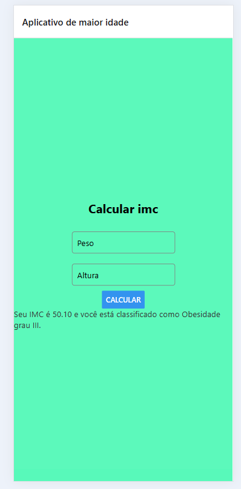

# IMC

## Calcule seu imc:



esse projeto [imc](https://expo.dev) foi criado com [`create-expo-app`](https://www.npmjs.com/package/create-expo-app).

## Get started

1. Install dependencies

   ```bash
   npm install
   ```

2. Start the app

   ```bash
   npx expo start
   ```